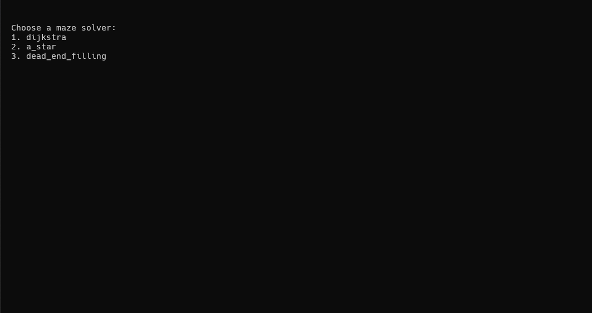

# Maze Generator and Solver

This project is a comprehensive implementation of various maze generation and solving algorithms. It leverages a range of Data Structures and Algorithms (DSA) concepts, including backtracking, Disjoint Set data structures, and generic programming, to efficiently generate and solve mazes. Additionally, the project now includes an interactive gameplay experience, allowing users to select algorithms and dynamically solve the maze during play.

## Sample gameplays

Please note that the actual look and feel of the generated gameplay is could be much better depending on the terminal that you are using. At the moment of writing these images were generated from WSL terminal run and looks downright ugly.

#### Sample maze - 1

#### Sample maze - 2

#### Interactions during gameplay
##### Start of the game

##### Help when stuck

Gameplay Features

- **Algorithm Selection**: At the start of the game, players can choose the maze generation algorithm from options like Wilson's, Prim's, Kruskal's, etc. Additionally, players can decide if the maze should have multiple paths.

- **Solver Options**: If stuck, players can press H to bring up a menu that allows them to choose a maze-solving algorithm, such as DFS, Dijkstra's, or A\*.

## Maze Generators

1. **DFS / BFS Backtracking**
   - Utilizes depth-first search or breadth-first search to carve out a maze, ensuring that every cell is reachable without any loops.

2. **Wilson's Algorithm**
   - Generates a maze by performing random walks from unvisited cells until they connect with an existing path, preventing loops and creating a perfect maze.

3. **Randomized Kruskal's Algorithm**
   - Uses the Disjoint Set Union (DSU) data structure to ensure that the maze remains acyclic while randomly selecting walls to remove, connecting different regions.

4. **Randomized Prim's Algorithm**
   - Begins from a random cell and expands the maze by randomly adding adjacent cells, ensuring the maze is fully connected without cycles.

5. **Eller's Algorithm**
   - Iteratively generates rows of the maze, randomly connecting cells and ensuring that each row is connected to the next, creating a perfect maze without backtracking.

## Maze Solvers

1. **DFS / BFS Backtracking**
   - Explores all possible paths from the start to the end, backtracking when a dead-end is reached, ensuring the shortest path is found in an unweighted maze.

2. **Dijkstra's Algorithm**
   - Applies the shortest path algorithm to solve weighted mazes, ensuring the optimal path from start to finish is found based on distance.

3. **A-star Algorithm**
   - An advanced pathfinding algorithm that uses heuristics to efficiently find the shortest path, especially useful for larger or more complex mazes.

4. **Dead End Filling**
   - Iteratively fills in all the dead ends in a maze, leaving only the solution path intact.

## Concepts Used

- **Backtracking**: Employed in both generation and solving algorithms like DFS/BFS, where paths are explored recursively and backtracked when a dead end is encountered.
  
- **Disjoint Set Data Structures (DSU)**: Used in algorithms like Randomized Kruskal's and Eller's to manage sets of connected cells, ensuring that the maze remains acyclic and well-connected.
  
- **Generic Programming**: Enables flexible implementation of algorithms, allowing the disjoint set structure to accommodate varied key types and adapt easily to different maze configurations and solving strategies.

- **Multi-Solution Maze Modification**: Introduced functionality that modifies the maze to have multiple solutions. This is particularly useful for applying advanced pathfinding algorithms such as Dijkstra and A\*, which benefit from the presence of multiple paths in the maze.

This project is designed to be an educational resource as well as a practical tool for generating and solving mazes using a variety of well-known algorithms. Additional solvers will be added to further enhance its capabilities.
